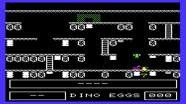

# My games for VIC-20

In this repsitory you'll find some games I wrote between 1982 and 1984 for the
VIC-20. At that time I was 15, so the purpose was mainly for fun and learning.

The games were written originally directly in 6502 machine language in memory,
using a self-developed disassembler (use of an assembler was not possible due
to memory constraints). This means in particular the code was not relocatable,
so all variable and jump addresses were hard-coded. I had calculate all the
branch offsets manually, and re-calculate when inserting code. I achieved this
by maintaining a copy of the code on paper, and cutting the paper with a
scissor when inserting code. On paper I also could maintain comments to the
code.

The code you find here is typed in newly using the hex dump also contained on
these paper trails. Afterward I ran the image through the "dxa" disassembler
and reverse-engineered its meaning to allow extending the original sparse
comments. The result of this process is checked in as initial revision in git.
Afterward I did some cleaning up of the code (such as introducing symbolic names
for variables and functions), further improvement of documentation, bug-fixing
and a few adaptions and extensions noted below. As a result the games now play
nicely in the excellent [VICE](http://vice-emu.sourceforge.net/) VIC-20
emulator.

## Dino-Eggs game

In this game the world consists of 4 levels in a cave between which the
player can traverse via ladders and by jumping. The objective is picking
up Dino eggs buried in the ground and sometimes hidden by stones. To
keep the Dino mum away, the player has to keep a fire going, which needs
to be kindled by wood to be found in the cave. All the while the player
has to watch out for snakes crawling across the levels, or hidden in
the ground beneath stones.

I didn't completely finish this game. I still have sketches showing I had
planned for spiders crawling on the ceiling of the cave and occasionally
lowering themselves (this explains the empty space at the top of the current
game); also there's no sound yet. The code implementing the snakes somehow got
lost (except for the jump to the start of that code), so that I had to
re-implement it as I remember it.

For more details see the [Dino-Eggs documentation](docs/dino_eggs.md).

## Snakes game

The game simulates a bunch of snakes wriggling around on a field, between which
the player needs to run around and pick up items. Of course the player also has
the option of killing the pest.

I do not recall where I got the idea for this game; I guess I saw a similar
game maybe running on an Arcade machine in a movie or TV show. What I liked
best about it is the movement of the snakes. I recall I had some trouble coming
up with a game objective built around those cool snakes.

For more details see the [Snakes documentation](docs/snakes.md).

## 10-Miles-Runner

This is likely one of the first machine language programs I wrote. It's an
extremely simplified variant of the Space Invaders theme. In this game, an
alien space ship (symbol) is just toggling from left to right side at the top
of the screen, firing at the player at the bottom of the screen. With each
iteration, the ship is coming closer to the player. The player has evade the
ship's fire by moving left or right, and try hitting the ship with his own
missiles before the ship reaches him at the bottom.

For more details see the [10-Miles-Runner documentation](docs/10_miles_runner.md).

I have no idea where the name of this game came from. Implementation is very
short at just under 350 lines assembly. Apparently this was a direct
translation from an earlier version written in BASIC. The game does not even
use user-defined characters for the objects shown on screen. I just included it
here, as it nicely shows the learning curve, starting with this initial
attempt, (actually followed by a Pac-Man derivate not included here as the
code for generating the maze is missing), then the already much larger snakes
game, and finally the dino-eggs game.
