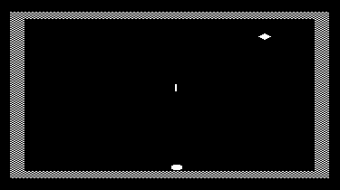

# 10-Miles-Runner game

The objective of this game is destroying the space ship that's spiraling down
from outer space onto earth, while avoiding the missiles fired at you by the
ship.

## Meaning of symbols on screen

| Item | Symbol | Meaning |
|:-----|:------:|:--------|
| Spaceship | caret | This represents the target that needs to be hit with your missiles. |
| Missile   | vertical line  | These are missiles fired by yourself or by the enemy ship. |
| Player    | fat dot | This represents the player under your control. |

## Game controls

Upon start of the game or a new level press any key to start.

The following table shows the keys that are used to control the player in the game:

| Key              | Action                                       |
|:-----------------|:---------------------------------------------|
| a                | Move player to the left                      |
| s                | Move player to the right                     |
| Space            | Fire a missile straight up                   |

## Game principles

To win the game, the player has to manage hitting the space ship with a
missile. The missiles always fly straight up at constant speed, so the player
needs to fire the missile sufficiently in advance so that the enemy moves into
its way. The enemy has no capability of evading the player's missiles. A new
missile cannot be fired until the previous one has reached the top border of
the screen.

While the enemy ship is spiraling down from above, the enemy will fire a
missile at the player whenever straight above it (unless the player is moving
fast in the opposite direction). The player is able to evade the missile by
moving left or right.

When the player has managed to hit the enemy, or inversely the enemy has hit
the player, the game freezes for a few seconds and then starts all over again.
Each time the game is won, the next round will run a little faster.
