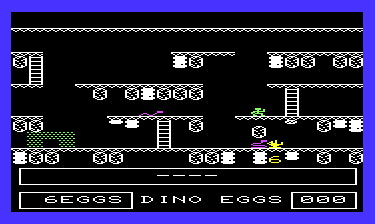

# Dino-Eggs game

The objective of this game is stealing all the Dino Mum's eggs that are hidden
in the ground or beneath stones, while avoiding being killed by the dino mum or
little snakes.  The eggs need to be picked up and carried to the variable home
station, from where they are beamed away to a far-away mothership.

## Game controls

The following table shows the keys that are used to control the player in the game:

| Key              | Action                                       |
|:-----------------|:---------------------------------------------|
| a                | Move player to the left                      |
| s                | Move player to the right                     |
| w                | Climb up on a ladder                         |
| z or y           | Climb down on a ladder                       |
| SHIFT + a,s      | When pressed while moving left or right, the player starts jumping in the same direction (for example across a gap in the bases) |
| F1               | Jump straight up.                            |
| Space, F7        | Special actions, see list below.             |

The following special actions can be triggered by F7 or space:

* Pick up eggs, if there are any below the base (and the player's hands are not full yet).
* Pick up wood, if there is any below the base (and the player's hands are not full yet).
* Put down up to 3 carried eggs, or wood, if the base below the player is empty.
* Start a fire, if the player carries wood and there is wood at the base below
  the player (i.e. two pieces of wood combined start a fire).
* When in the home station and at least 6 eggs are carried, beam the eggs away
  to the mother station. If these were the last eggs, this also ends the game.
  Else the player is beamed to a random new location on any of the bases.

## Meaning of symbols on screen

| Item | Symbol | Meaning |
|:-----|:------:|:--------|
| Player |  | Represents the player figure under your control. It changes shape depending on the direction it's moving at. |
| Ladder between bases |  | Ladders can be used to climb up or down between levels. |
| Dino eggs |  | This symbol shows three eggs stored below a base. Equivalently there can be only one or two eggs. |
| Wood |  | This is a piece of wood stored below a base. |
| Power gain |  | This special item grants you temporarily additional power to carry more eggs. You still can't carry eggs and wood at the same time. |
| Snake egg |  | This is a snake egg. Don't pick this up or they will bite you. |
| Stone under base |  | This is a stone under which other items may be hidden. |
| Coiled-up snake |  | This is a snake in coiled-up state. It may start moving any time, unless resting next to a fire. |
| Crawling snake |  | This is a snake crawling to the right. Snakes crawl in this direction only. |
| Fire |  | This is a fire, started by the player. The digit below hints how much longer it will be burning. |
| Home base |  | This is the home base, where the player needs to deposit collected eggs. It will move to itself and the player to a random new position afterward. |

## Game principles

The game objective is picking up all the eggs and depositing them in the home
station.  To pick up eggs, the player moves to a base beneath which eggs are
visible and presses F7.  The player can normally carry at most 6 eggs at a
time. There is a special "power gain" symbol that can be picked up to gain
strength for 24 eggs - but only for one trip to the home station. The items
currently carried are shown in the box in the lower-left corner of the screen.

To deposit the eggs, move the player into the middle of the home station and
press F7.  This will unload the eggs, increase the score by one point for each
egg (shown in the box in the lower-right corner of the screen), and then beam
the player to a new random location. The game is won when no eggs are left in
the playing field.  (Note the home station allows beaming up only with at least
6 carried eggs. Take care when using the power-gain not to end up with less
than 6 eggs on the field, or you'll not be able to complete the game.)

To move between levels, the ladders can be used. The upper layers have gaps,
across which you maybe able to jump by holding SHIFT while moving. It's possible to
return to a lower level by jumping or falling down. However take care not to
fall too far, or you'll die when hitting the ground. You may also notice that
when leaving the screen to the left or right, the player inexplicably shows up
dropping onto the same base on the opposite side.

Many items will be hidden beneath stones. To get at these, dislodge the stone
by pressing F7. The stone will fall onto the base beneath; if there is also a
stone, that one will fall too and so on. If there's a snake in the way, it will
be killed. But take care not to extinguish your fire this way. Sometimes you'll
find there was a snake hiding beneath the stone; it will fall onto the base below.

Generally stay out of the way of snakes, or they will bite and kill you
instantly.  Thankfully you can run faster than them; you can also dispatch them
by jumping on top of them.

To keep the Dino Mum away, the player has to start a fire by picking up a
piece of wood and put it down on top of another piece. (Take care not to keep
standing in the burning fire.) While a fire is burning, there's a digit below
counting down from 9 to 1 to indicate how soon it will go out. To avoid this,
you can start a new fire already while the first is still burning.  When you
fail to adhere, there'll first be a warning "make a fire", then "dino mum
coming". If there's still no fire started afterward, she will come and stomp
you:

*Have fun!*

<!---
  Cropping XVIC screenshots:
  pngtopnm src.png | pnmcut -left 85 -top 28 -width 375 -height 224 | pnmtopng > tmp.png
-->
