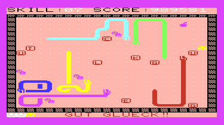

# Snakes game

The objective of this game is picking up a sequence of bonus letters in
a given order, while avoiding being eaten by the snakes.

There is a strategic component, as the player can regularly cross only fields
containing a food item (symbolized with "o"). However whenever the player or a
snake leaves a field, it leaves excrement (symbolized with dot ".") in its
place. To cross such a field, the player has to hold down the SHIFT key in
addition to the direction (or press FIRE button on the joystick).  Any such
field that is crossed costs one "skill" point, as shown in the upper-left
corner.  When all skill is depleted, the player can convert score points to
skill. If score is insufficient, the player may defeat using F1. But the player
can also earn skill and score by killing snakes, picking up the bonus letters,
or the special "apply" bonus symbols.

Note snakes are moving completely at random. In particular, they are not aware
of the player and will not move towards it intentionally. However there's a 25%
chance in each move for turning, so it's generally not safe to stand next to
the path where snake is heading.

## Game controls

The following table shows the keys that are used to control the player in the game:

| Key              | Action                                       |
|:-----------------|:---------------------------------------------|
| w                | Move player upwards                          |
| z or y           | Move player downwards                        |
| a                | Move player to the left                      |
| s                | Move player to the right                     |
| SHIFT + w,z,a,s  | Allows movement across "excrement", or       |
|                  | eating a snake when hitting a snake tail.    |
| Insert           | Buy skill points from score points           |
| F1               | End or defeat the game                       |

When using joystick, movement is obviously done by moving the stick.  The fire
button replaces the use of SHIFT. For the other functions you still need to
reach for the keyboard. Note I haven't tested the joystick with VICE (i.e. not
since 1984), so I cannot guarantee it'll work in the current version of the
game.  When playing on a real VIC-20 keyboard, you can use the left arrow
instead of F1 and the Pound key instead of "Insert".

The player can regularly move only onto fields containing food, a special bonus
symbol (see list below), the next bonus letter in sequence (after race to start
is completed), or a snake head or tail. Any other move is blocked and a low
beep is emitted to indicate the rejection.

Naturally, touching a snake head will result in immediate death. The player
however can "ride" a snake tail by moving in the same direction as the tail.
This could be used for crossing sections of the playing field without food,
whithout using up skill points.  The recommended way for eating a snake is
moving against a snake's side while already holding the SHIFT  key. The move
will be rejected until the snake tail finally comes by, at which time the
player automatically starts eating.

## Meaning of symbols on screen



| Item | Symbol | Meaning |
|:-----|:------:|:--------|
| Food | o | Provides 10 points score. |
| Excrement | . | Can only be crossed by the player while holding the SHIFT/fire key and costs one skill point. |
| Bonus letters |  | These circled letters need to be touched by the player in order as printed at the bottom if the screen.  Once touched, they will also show circled at the bottom, so that you know which letter is next. |
| Apple |  | Grants 250 scorepoints and 2 skill points. The symbol is left randomly by snakes instead of excrement. |
| Snake spawn |  | Spawns a new snake from the middle of the screen and grants 2 skill points.  Up to 6 snakes can be active at the same time. This symbol is left randomly by snakes instead of excrement. |
| Snake tail | | Stepping onto a snake's tail provides 7 score points. If the SHIFT/fire key is held at the same time, the player starts eating the snake; this scores 1782 points. |
| Snake head | | Stepping onto a snake's tail provides 7 score points. If the SHIFT/fire key is held at the same time, the player starts eating the snake; this scores 1782 points. |
| Ghost |  | When the player is eaten by a snake, it finally excretes this symbol, which marks the position where the player would resume when it is revived. |

## Race to start

There is an initial phase in each game level that has to be completed
before the player can start earning score.


When starting the game, a black circle appears in the middle of the playing
field, while the player figure is always in the lower right corner. The
player has to move onto the field of the circle. Before this is achieved,
the player can neither pick up any of the bonus chars, nor any of the other
bonus symbols, nor kill any of the snakes.

Until the circle is reached, the status line at the bottom of the screen shows
message "Race to start: (o)". Afterwards the status displays the bonus letter
sequence. The skill is reset to 4 at this time and a score bonus is awarded for
each of the initial skill points that was not spent in the race.

As you can see in the screenshot, the initial skill provided is only 3, and the
player has no way yet to earn score, so the player needs to be real quick in
this phase to avoid the snakes eating the food on the way to the circle target.
If the way to the circle is blocked, the player can only defeat one life and
try again after restarting the level.

## Game principles

Utimately, the goal of the game is achieving score and beating the highscore,
which is predefined at 126722 (reached by the author himself when originally
developing the game). Score is achieved by fulfilling the objective of
collecting the bonus letters, but also concurrently while killing snakes
or picking up special items.

After finishing the race to start, the main game objective can be addressed,
namely picking up the bonus letters. The letters can only be picked up in the
sequence shown in the status line at the bottom of the screen. For the two
duplicate letters you can pick whichever of the letters is nearest to the
player.

```
        GUT GLUECK
```

You need skill points for being able to cross excrement which is left when
snakes or the player moves. Each spot containing excrement that is crossed
costs one point. When all points are exhausted, the player can buy 4 extra or 2
points if the score value exceeds 1000 or 500 respectively.

Once all the letters are picked up, you can end the game using the F1 key.
The game does not end automatically, since you can still use the remaining
food and possible special items on the field to increase your score. Ending
the game will get you a bonus of 3000 points if all snakes are dead, else 2000.
Additionally there's a bonus of 200 for each remaining skill point.

When the game is ended sucessfully, a new level of the game starts
automatically after a short pause. All the levels work identically, except that
the speed of the movement increases. Your score value is carried across into
the new level, but you get 1 new fresh life, or a bonus if you still have two
spare lifes.

Regarding player lifes: Upon start of each the player has 3 lifes: One in use,
and two reserves.  The number of reserves is shown in the bottom left corner of
the screen.  A life can be lost either by being bitten by a snake, or by defeat
when skill has run out:

* When bitten by a snake, the player remain in "ghost" state on screen. It can
  be revived by hitting the "F1" key, if there are spare lifes left. Else, F1
  ends the game.
* When defeating using F1, the level restarts immediately with one less spare life.

*Have fun!*

<!---
  Cropping XVIC screenshots:
    pngtopnm src.png | pnmcut -left 85 -top 35 -width 375 -height 210 | pnmtopng > tmp.png
  Transparent background (orange):
    pnmtopng -transparent rgb:ff/ff/ac ...
  Symbol dimensions: pnmcut -height 10 -width 18 ...
-->
